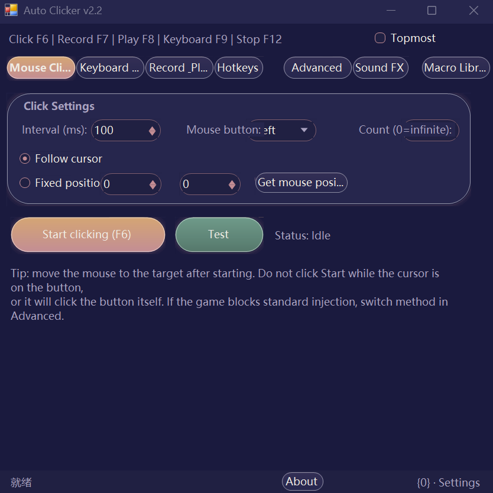

# AutoClickerTool

> Windows mouse & keyboard automation tool · Pure C# WinForms · Zero third-party dependencies · Single-file portable

**Language / 语言**: [English](README.en.md) · [中文](README.md)

[](LICENSE)

A Windows automation tool for game farming / auto-clicking scenarios. Features a mouse auto-clicker, key spammer, macro record & replay, global hotkeys and key sound effects; a built-in humanization engine and three input injection methods (including driver-level), designed specifically for scenarios where scripts get detected by games.

## 📸 Screenshot



## ✨ Features

- 🖱️ **Mouse Clicking** — auto-click at fixed intervals; follow the cursor or lock to coordinates; optional click count limit
- ⌨️ **Keyboard Spam** — timed tap / hold modes
- ⏺️ **Record & Play** — records real mouse/keyboard actions via global low-level hooks, auto-merges redundant actions (consecutive moves merged into one "move to end point", short presses merged into clicks/key taps); editable, saveable, replayable in loops at variable speed
- 🔥 **Global hotkeys** — all 5 function toggles fully customizable, any key combination: multi-key combos (e.g. `Ctrl+Q+W`), mouse side buttons, media keys
- 🔊 **Key sound effects** — bind any single key / combo to a wav/mp3 sound; plays on press; a new key cuts off the currently playing sound (cut-off playback)
- 🎭 **Humanization engine** — Gaussian-distributed intervals, landing-point jitter & drift, randomized press duration, bezier movement trajectories to reduce the "scripted" feel
- 🛡️ **Three injection methods** — SendInput / SendMessage / Interception (driver-level), for different detection schemes
- 🎨 **6 themes + Chinese/English UI** — fully owner-drawn controls (Clay control library); window border / title bar follow the theme
- 🖥️ **Per-monitor DPI awareness** — layout auto-rebuilds on cross-monitor dragging / scaling changes
- 📦 **Zero dependencies** — compiled directly with the `csc.exe` bundled in .NET Framework 4.0; no NuGet, no third-party DLLs

## 🚀 Quick Start

**Ready to use**: download `AutoClicker.exe` from the [Release](../../releases) page and double-click to run (Windows ships with .NET Framework — nothing to install).

**Build from source**:

```
src\build.bat
```

Outputs `AutoClicker.exe` to the repository root. Only the system built-in csc.exe is required — no SDK installation needed.

See [使用说明.txt](使用说明.txt) (user manual, Chinese) for detailed instructions.

## ⌨️ Default Hotkeys

| Function | Default hotkey |
|---|---|
| Clicker toggle | F6 |
| Recording toggle | F7 |
| Playback toggle | F8 |
| Keyboard toggle | F9 |
| Stop all | F12 |

All hotkeys can be changed to any key combination on the "Hotkeys" page; changes are saved immediately and take effect on the next launch.

## 🛡️ Anti Script-Detection (Advanced page)

Common ways games block auto-clickers and the corresponding countermeasures:

| Detection method | Countermeasure |
|---|---|
| Input events carry the "injected" flag | **SendMessage** mode: posts window messages directly, bypassing the injected flag |
| Raw input only / driver-level detection | **Interception** driver mode: driver-level injection, indistinguishable from real hardware |
| Statistical detection: fixed rhythm, identical coordinates | **Humanization**: Gaussian intervals, landing-point jitter, randomized press duration, bezier trajectories |
| Keyboard accepts scan codes only | Scan-code injection option |

**Installing the Interception driver**: download the release from [oblitum/Interception](https://github.com/oblitum/Interception), install the driver as administrator, then place the matching-architecture `interception.dll` next to the program. Note: when kernel isolation / memory integrity (HVCI) is enabled, unsigned drivers cannot load.

If a game detects by process name, simply rename the exe file.

## 🎭 Humanization Engine

Master switch + four independent sub-switches (master off = all fixed values):

- **Timing** — intervals follow a Gaussian distribution ±N% (3σ coverage), 3% chance of inserting a hesitation pause
- **Position** — ±N pixel jitter + slow ±1px drift per click
- **PressDuration** — Gaussian 40~180ms (default fixed 20ms)
- **Trajectory** — bezier curves + random curvature + Fitts' law duration + smoothstep ease-in/out

## ⌨️ Hotkey Format

```
F6                 single key
Ctrl+Shift+K       modifier combo
Ctrl+Q+W           multi-key combo (pressed together to trigger)
Alt+MouseX1        mouse side button
Volume+            media key
```

Common key names: F1~F24, A~Z, 0~9, Esc, Space, Enter, Tab, Backspace, CapsLock, Insert, Delete, Home, End, PageUp, PageDown, ↑↓←→, Num0~Num9, Mouse Left/Right/Middle/X1/X2. Case-insensitive.

## 🎵 Key Sound Effects

On the "Sound FX" page you can bind any single key or combo to a wav/mp3 sound file (automatically copied into the `Sounds` folder). Plays on press; a newly pressed key cuts off the currently playing sound. Supports a master switch, global volume and per-key volume.

## 📁 Project Structure

| Path | Description |
|---|---|
| [src/MainForm.cs](src/MainForm.cs) | Main UI: 7 tab pages, config load/save, DPI sync, DWM border theming |
| [src/InputSimulator.cs](src/InputSimulator.cs) | Input injection hub: SendInput / SendMessage / Interception routing |
| [src/Humanizer.cs](src/Humanizer.cs) | Humanization engine |
| [src/HotkeyManager.cs](src/HotkeyManager.cs) | Global hotkey engine (low-level hooks) |
| [src/MacroRecorder.cs](src/MacroRecorder.cs) / [src/MacroPlayer.cs](src/MacroPlayer.cs) | Macro recording / playback |
| [src/AutoClicker.cs](src/AutoClicker.cs) / [src/KeyboardSpammer.cs](src/KeyboardSpammer.cs) | Mouse auto-clicker / key spammer engines |
| [src/SoundFx.cs](src/SoundFx.cs) | Key sound effects |
| [src/Clay.cs](src/Clay.cs) / [src/Theme.cs](src/Theme.cs) | Owner-drawn control library / 6 themes |
| [src/Lang.cs](src/Lang.cs) | Chinese / English localization |
| [src/build.bat](src/build.bat) | One-click build script |
| [docs/CLAUDE.md](docs/CLAUDE.md) | Project maintenance manual (architecture, data flow, pitfalls; for future maintainers & AI collaboration) |
| [使用说明.txt](使用说明.txt) | User manual (Chinese) |

## ❓ FAQ

- **Antivirus false positives / deleted files**: automation & injection tools are prone to heuristic false positives (Kaspersky previously deleted it). Add the program folder to your antivirus exclusions.
- **Hotkey does nothing**: it may be occupied by another program — pick a different combo.
- **Game still detects the script**: try in the order of the "Advanced" page: keep humanization on → switch to SendMessage injection → install the Interception driver.
- **Reset to defaults**: delete `config.json` in the program folder.

## ⚠️ Disclaimer

This software is for learning and technical exchange only. Do not use it in ways that violate game terms of service or laws and regulations; users are responsible for their own actions.

## 📄 License

[MIT](LICENSE) © 2026 R2S-ver
