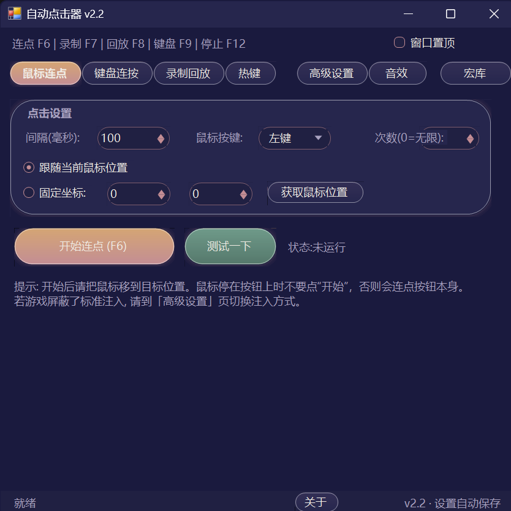

# 自动点击器 AutoClickerTool

> Windows 鼠标键盘自动化工具 · 纯 C# WinForms · 零第三方依赖 · 单文件绿色运行

**语言 / Language**: [中文](README.md) · [English](README.en.md)

[](LICENSE)

面向游戏挂机 / 自动点击场景的 Windows 自动化工具。支持鼠标连点、键盘连按、宏录制回放、全局热键、按键音效；内置拟人化引擎与三种输入注入方式（含驱动级），针对"被游戏检测为脚本"的场景做了专门的对抗设计。

## 📸 界面预览



## ✨ 功能特性

- 🖱️ **鼠标连点** — 固定间隔自动点击，可跟随光标或锁定坐标，可设定次数
- ⌨️ **键盘连按** — 定时点按 / 按住两种模式
- ⏺️ **录制回放** — 全局低级钩子录制真实鼠标/键盘操作，自动合并冗余动作（连续移动合并为"移动到终点"、短按合并为单击/按键），可编辑、保存、按倍速循环回放
- 🔥 **全局热键** — 5 个功能开关全部可自定义，支持任意组合键：多键组合（如 `Ctrl+Q+W`）、鼠标侧键、媒体键
- 🔊 **按键音效** — 任意单键/组合键绑定 wav/mp3 音效，按下即播，新键覆盖旧音效（覆盖式播放）
- 🎭 **拟人化引擎** — 高斯分布间隔、落点抖动漂移、随机按键时长、贝塞尔移动轨迹，降低"脚本感"
- 🛡️ **三种注入方式** — SendInput / SendMessage / Interception 驱动级，应对不同的检测手段
- 🎨 **6 套主题 + 中英双语** — 全自绘控件（Clay 控件库），窗口边框/标题栏跟随主题
- 🖥️ **每显示器 DPI 感知** — 跨屏拖动 / 缩放变化自动重建布局
- 📦 **零依赖** — .NET Framework 4.0 自带的 `csc.exe` 直接编译，无 NuGet、无第三方 DLL

## 🚀 快速开始

**直接使用**：下载 [Release](../../releases) 中的 `AutoClicker.exe`，双击运行即可（Windows 自带 .NET Framework，无需安装任何东西）。

**从源码构建**：

```
src\build.bat
```

输出 `AutoClicker.exe` 到仓库根目录，仅需系统自带的 csc.exe，无需安装 SDK。

详细操作见 [使用说明.txt](使用说明.txt)。

## ⌨️ 默认热键

| 功能 | 默认热键 |
|---|---|
| 鼠标连点开关 | F6 |
| 录制开关 | F7 |
| 回放开关 | F8 |
| 键盘连按开关 | F9 |
| 全部停止 | F12 |

所有热键均可在「热键」页改为任意组合键，改完立即保存，下次启动生效。

## 🛡️ 防脚本检测（高级设置页）

游戏屏蔽自动点击的常见手段与对应方案：

| 检测手段 | 方案 |
|---|---|
| 检测输入事件带"注入"标记 | **SendMessage** 模式：直发窗口消息，绕过注入标记 |
| 只认原始输入 / 驱动层检测 | **Interception** 驱动模式：驱动级注入，与真实硬件无异 |
| 统计检测：固定节奏、坐标完全一致 | **拟人化**：间隔高斯分布、落点抖动、按键时长随机化、贝塞尔轨迹 |
| 键盘只认扫描码 | 扫描码注入选项 |

**Interception 驱动安装**：到 [oblitum/Interception](https://github.com/oblitum/Interception) 下载 Release，以管理员身份安装驱动，再把对应位数的 `interception.dll` 放到程序目录。注意：系统开启内核隔离/内存完整性（HVCI）时，未签名驱动无法加载。

如果游戏按进程名检测，可自行重命名 exe 文件。

## 🎭 拟人化引擎

总开关 + 四个独立子开关（关闭总开关 = 全部固定值）：

- **Timing（间隔）** — 间隔按高斯分布 ±N%（3σ 覆盖），3% 概率插入犹豫停顿
- **Position（落点）** — ±N 像素抖动 + 每次 ±1px 缓慢漂移游走
- **PressDuration（按键时长）** — 高斯分布 40~180ms（默认固定 20ms）
- **Trajectory（轨迹）** — 贝塞尔曲线 + 随机曲率 + Fitts 定律时长 + smoothstep 加减速

## ⌨️ 热键格式

```
F6                 单键
Ctrl+Shift+K       修饰键组合
Ctrl+Q+W           多键组合（同时按下触发）
Alt+鼠标X1         鼠标侧键
音量+              媒体键
```

常用键名：F1~F24、A~Z、0~9、Esc、Space、Enter、Tab、Backspace、CapsLock、Insert、Delete、Home、End、PageUp、PageDown、↑↓←→、Num0~Num9、鼠标左键/右键/中键/X1/X2。大小写不敏感。

## 🎵 按键音效

「音效」页可把任意单键或组合键绑定到 wav/mp3 音效文件（自动复制进 `Sounds` 文件夹），按下即播放，新按下的键会打断正在播放的音效；支持总开关、全局音量与单键独立音量。

## 📁 项目结构

| 目录/文件 | 说明 |
|---|---|
| [src/MainForm.cs](src/MainForm.cs) | 主界面：7 个标签页、配置加载/保存、DPI 同步、DWM 边框主题 |
| [src/InputSimulator.cs](src/InputSimulator.cs) | 输入注入中枢：SendInput / SendMessage / Interception 路由 |
| [src/Humanizer.cs](src/Humanizer.cs) | 拟人化引擎 |
| [src/HotkeyManager.cs](src/HotkeyManager.cs) | 全局热键引擎（低级钩子） |
| [src/MacroRecorder.cs](src/MacroRecorder.cs) / [src/MacroPlayer.cs](src/MacroPlayer.cs) | 宏录制 / 回放 |
| [src/AutoClicker.cs](src/AutoClicker.cs) / [src/KeyboardSpammer.cs](src/KeyboardSpammer.cs) | 鼠标连点 / 键盘连按引擎 |
| [src/SoundFx.cs](src/SoundFx.cs) | 按键音效 |
| [src/Clay.cs](src/Clay.cs) / [src/Theme.cs](src/Theme.cs) | 自绘控件库 / 6 套主题 |
| [src/Lang.cs](src/Lang.cs) | 中英双语 |
| [src/build.bat](src/build.bat) | 一键编译脚本 |
| [CLAUDE.md](docs/CLAUDE.md) | 项目维护手册（架构、数据流、常见坑，写给未来维护者与 AI 协作） |
| [使用说明.txt](使用说明.txt) | 用户手册 |

## ❓ 常见问题

- **杀毒软件误报 / 删文件**：自动化注入类工具容易被启发式误报（曾触发卡巴斯基误删），把程序目录加入杀毒软件排除项即可。
- **热键按了没反应**：可能被其他软件占用，换一个组合键。
- **游戏仍能识别脚本**：按「高级设置」页顺序尝试：保持拟人化开启 → 换 SendMessage 注入 → 装 Interception 驱动。
- **想恢复默认设置**：删除程序目录下的 `config.json`。

## ⚠️ 免责声明

本软件仅供学习与技术交流，请勿用于违反游戏服务条款或法律法规的用途，使用者需自行承担相应责任。

## 📄 许可证

[MIT](LICENSE) © 2026 R2S-ver
